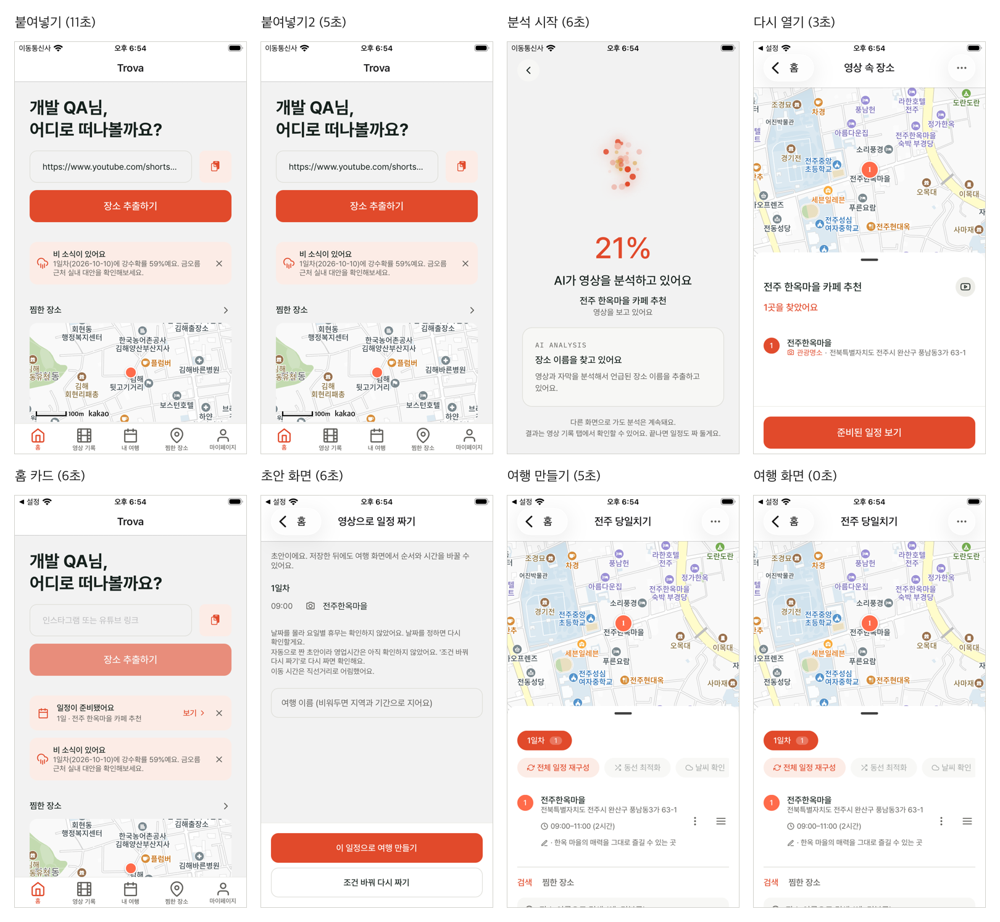

# qaflow

기능 QA에서 **매번 손으로 하던 일**을 묶은 Claude Code 플러그인입니다. 서비스마다 다른 것(테이블·API·좌표·명령)은
모두 설정 파일과 시나리오 파일로 받고, 스크립트에는 특정 서비스 내용을 넣지 않습니다.
짝: [devflow](https://github.com/taehyeooo/devflow)(개발·배포) · [uiflow](https://github.com/taehyeooo/uiflow)(디자인 QA)

| 구성 | 하는 일 |
|---|---|
| `qa-data` | QA 전 테이블별 마지막 id·개수 저장 → QA 뒤 그 이후 생긴 **테스트 계정 행만** 순서대로 삭제 → 개수 비교 |
| `qa-scenario` | 시나리오 파일(탭·붙여넣기·DB 상태 대기·캡처)을 한 줄로 재생, 단계별 시간·캡처를 한 장으로 |
| `qa-api` | API 묶음을 차례로 호출해 응답 코드·내용 조건 확인(로컬은 테스트 토큰 자동 갱신, 운영은 인증 없는 확인만) |
| `qa-env` | 모바일 앱 QA 환경 준비/원복(토큰·임시 패치·번들러·앱 재실행), 탭·캡처·글자 크기·백그라운드 |
| `qa-report` | 실행 환경 / 시나리오 단계·시간 / API·데이터 결과 / 못 한 것 틀의 보고서 초안 |



## 지원 범위
- `qa-data`, `qa-api`, `wait-sql`: DB 종류·백엔드 언어와 상관없음(설정의 SQL 실행 명령, HTTP 주소만 있으면 됨)
- `qa-env`, 시나리오의 탭·캡처: iOS 시뮬레이터. 탭은 기본으로 expo-mcp XCTest 드라이버, 설정 `env.tapCmd`로 다른 도구를 쓸 수 있음. 번들러(`env.bundlerCmd`)를 비우면 React Native 전용 단계는 건너뜀

## 설치
```
/plugin marketplace add taehyeooo/qaflow
/plugin install qaflow@qaflow
```
설정: `~/.config/qaflow/<origin 레포 이름>.json` (레포 밖). 예시: [`examples/config.example.json`](examples/config.example.json), 시나리오 예시: [`examples/scenarios/`](examples/scenarios)

## 사용 기록
[docs/usage-trova.md](docs/usage-trova.md)
